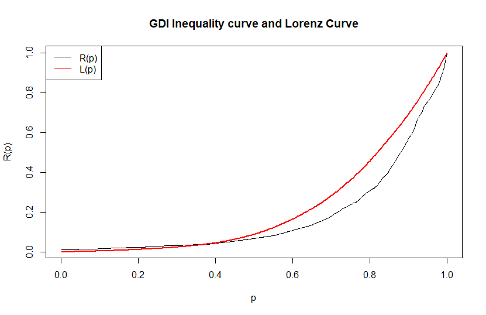
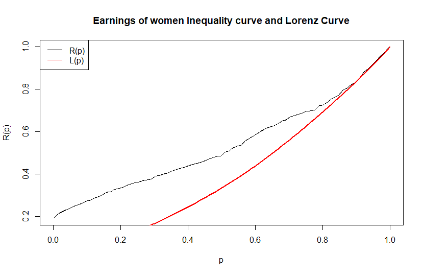

```{r setup, include=FALSE}
knitr::opts_chunk$set(echo = TRUE)
```

# 1. Introduction
## 1.1. Measures of Inequality

There exist various types of metrics used by economists to measure the income inequality. The most widely exploited ones are the Lorenz curves and the Gini coefficient, each of which have their own advantages and limitations. Those obvious limitations include the requirement for the population mean and variance to exist, as well as down-weighting smaller incomes and that way stressing way more attention to the middle incomes. This paper analyzes another income inequality measure, namely using ratios of symmetric quantiles, that proves to be helpful to overcome previously mentioned disadvantages. In addition to that, it is proven that the given metric satisfies the median preserving principle and applicable to widely used income distributions. But the major benefit is that there is no need of parametric model assumption to work with the given inequality measure.
  
  
# 2. Concepts and Definitions
## 2.1. Lorenz curve and Gini coefficient 

A Lorenz curve is a graph used in economics to show inequality in income spread or wealth. The x-axis on a Lorenz curve typically shows the portion or percentage of the total population, and the y-axis shows the portion of total income/ wealth, or whatever is being analyzed.

Since perfect equality would mean that a $1/k$ portion of the population controlled $1/k$ of the wealth, perfect equality on the graph would be shown by a straight line with a slope of 1. This line is often drawn on the graph as a point of reference, alongside the curved line which represents the actual wealth/income/size distribution. The further away from the 1/1 baseline a particular curve is, the more pronounced the inequality.Any point on the curve can be read to tell us what percentage or portion of the population command what percent of the wealth, income, or whatever variable is being studied.

```{r, echo=F, out.width='40%'}
knitr::include_graphics("plots/Lorenz curve.JPG")
```

Gini ratio (or Gini coefficient) is a measure of inequality, based on the Lorenz curve, that goes from 0 (absolute equality) up to 1 (absolute inequality). It's calculated as a ratio of the areas on the Lorenz curve diagram. If the area between the line of perfect equality and Lorenz curve is $A$, and the area underneath the Lorenz curve is $B$, then the Gini coefficient is $A/(A+B)$.  

Greater inequality shows up as a larger area between the Lorenz curve and the diagonal line of absolute equality. 
  
```{r, echo=F, out.width='40%'}
knitr::include_graphics("plots/Gini coefficient.JPG")
```
  
### Calculation

Since $A+B = 0.5$, the Gini coefficient, G = 2A = 1-2B. If the Lorenz curve is represented by the function Y = L(X), the value of B can be found with integration and:

$$
\begin{aligned}
G &= 1-2\int_{0}^{1} L(X)dX\\
\end{aligned}
$$
In some cases, this equation can be applied to calculate the Gini coefficient
without direct reference to the Lorenz curve. For example, for a population with values $y_i, i = 1...n$, that are indexed in non-decreasing order ( $y_i ≤ y_{i+1}$), with $S_i = \sum_{j=1}^{i}f(y_j)y_j, S_0=0$: 

$$
\begin{aligned}
G &= 1-\frac{\sum_{i=1}^{n}f(y_i)(S_{i-1}+S_i)}{S_n}\\
\end{aligned}
$$
For a cumulative distribution function $F(y)$ that is piecewise differentiable, has
a mean $\mu$, and is zero for all negative values of $y$:

$$
\begin{aligned}
G &= 1-\frac{1}{\mu}\int_{0}^{\infty}(1-F(y))^2dy  \\
\end{aligned}
$$
Sometimes the entire Lorenz curve is not known, and only values at certain intervals are given. In that case, the Gini coefficient can be approximated by using various techniques for interpolating the missing values of the Lorenz curve. If $(X_k,Y_k)$ are the known points on the Lorenz curve, with the $X_k$ indexed in increasing order $(X_{k-1} < X_k)$, so that: $X_k$ is the cumulated proportion of the population variable, for $k = 0,...,n$ with $X_0 = 0$, $X_n = 1$ and $Y_k$ is the cumulated proportion of the income variable, for $k = 0,...,n$, with $Y_0= 0$, $Y_n = 1$.

If the Lorenz curve is approximated on each interval as a line between consecutive
points, then the area $B$ can be approximated with trapezoids (Brown Formula) and:

$$
\begin{aligned}
G_1 &= |1-\sum_{k=1}^{n}(X_k- X_{k-1})(Y_k+ Y_{k-1})| \\
\end{aligned}
$$
is the resulting approximation for $G$.

More accurate results can be obtained using other methods to approximate the area B, such as approximating the Lorenz curve with a quadratic function across pairs of intervals, or building an appropriatelysmooth approximation to the underlying distribution function that matches the known data. If the population mean and boundary values for each interval are also known, these can also often be used to improve the accuracy of the approximation. 

### Advantages: The Gini coefficient's main advantage is that it is a measure of inequality, not a measure of average income or some other variable which is unrepresentative of most of the population, such as gross domestic product.It can be used to compare income distributions across different population sectors as well as countries, for example the Gini coefficient for urban areas differs from that of rural areas in many countries.

### Disadvantages: The Lorenz curve may understate the actual amount of inequality if richer households are able to use income more efficiently than lower income households. Lorenz curves may intersect, reflecting differing patterns of income distribution, but nevertheless resulting in very similar Gini coefficient values.This troubling property of the Lorenz framework complicates comparisons of Gini coefficient values and may confound tests of the income inequality hypothesis.It is also claimed that the Gini coefficient is more sensitive to the income of the middle classes than to that of the extremes. 

## 2.2. Basic properties of the ratio of symmetric quantiles

Say $F$ satisfy $F(0−) = 0$ and the $p$th quantile $x_p = Q(p) = F^{−1}(p) = inf(x : F(x) ≥ p), 0 < p < 1$.The symmetric ratio of quantiles for $0 < p < 1$ is given by $R(p) = x_{p/2}/=x_{1−p/2}$

So, for each $p$, $R(p)$ gives the ratio of the typical (median) income of the lowest proportion $p$ of incomes to the typical (median) income of the largest proportion $p$. Extend $R$ to [0,1] by defining $R(0) = 0$ and $R(1) = 1$. 
The graph $(p; R(p))$ of R has the following properties:
1. $0 ≤ R(p) ≤ 1$
2. $R(p)$ is monotone increasing from $R(0) = 0$ to $R(1) = 1$
3. $R(p) = 1$ for all $0 < p < 1$ if and only if all incomes are equal.
4. $R(p)$ is scale invariant.
5. After any median preserving transformation of funds from the upper half of incomes to the lower half of incomes, $R(p)$ can only increase.

We define ratio of inequality by $I = I(F) = 1- \int_{0}^{1}R(p)dp$ and interpreted as "if one selects an income at random from those below the median and divides it by its symmetric quantile, on average
one obtains $1−I(F)$. Therefore, $I(F)$ has the simple interpretation as the average relative
distance $(Y − X)/Y$ of $X$ from its symmetric quantile $Y$.
These properties of $I$ lead to explore the inequality measure as an alternative to the Gini Index which is defined as:

$$
\begin{aligned}
G &= 1-\frac{1}{E(X)}\int_{0}^{\infty}(1-F(x))^2dx  \\
\end{aligned}
$$


# 3. Methodology

Based on the above properties we calculate the ratio of symmetric quantiles, where $I$ lies between 0 and 1, defined by:

$$
\begin{aligned}
I &= 1-\int_{0}^{1}\frac{x_{p/2}}{x_{1-p/2}}dp = 1- \int_{0}^{1}R(p)dp \\
\end{aligned}
$$

# 4. Application

The given concept was applied to three sets of data below. Namely, Disposable Personal Income, Gross Domestic Income, Earnings Data of Women in the USA. 

## 4.1. Disposable Personal Income.

The data of Disposable Personal Income between 1959 and 2020 can be obtained at https://fred.stlouisfed.org/series/DSPI. 
Firstly, $I$ and $G$ were calculated for the Disposable Personal Income Data. It appears that $\hat I=0.7561$, which is an estimate of $I$, with a standard error of $0.0106$. Additionally, 95% confidence interval of $\hat I$ was calculated to be $(0.7352, 0.7769)$. While $\hat G = 0.4872$ is significantly lower, with a standard error of $0.0095$ and respective 95% confidence interval of $(0.4686, 0.5059)$. Below is the Inequality curve of the data plotted over it's Lorenz curve.

```{r, echo=FALSE, fig.cap="Income inequality curve and Lorenz curve of Disposable Personal Income in the US between 1959 and 2020", fig.align="center",out.width = '70%'}
knitr::opts_chunk$set(fig.pos = 'H')
knitr::include_graphics("plots/DSPI curves.png")
```

One can observe that the Lorenz curve underestimates the income inequality relative to income inequality curve after 40% of population mark. 

## 4.2. Gross Domestic Income.
The data on Gross Domestic Income can be found here: https://fred.stlouisfed.org/series/GDI. As results reveal, ratio of symmetric quantiles of the GDI is $\hat I=0.8204$ with a standard error $0.0162$ and confidence interval $(0.7886,0.8523)$. At the same time $\hat G=0.5499$ with a standard error of $0.0161$ and CI $(0.5182,0.5815)$.

```{r, echo=FALSE, fig.cap="Income inequality curve and Lorenz curve of Gross Domestic Income in the US between 1947 and 2020", fig.align="center",out.width = '40%'}
knitr::opts_chunk$set(fig.pos = 'H')

```

Similarly to the previous data set we can see the relative underestimation of income inequality by Lorenz curve in GDI as well. However this time the discrepancy seems to be larger which is reflected in a slightly bigger difference between $\hat I$ and $\hat G$ in this data set. 

## 4.3. Earnings Data of Women in the USA.
The data on Earnings of women in the US between 1979 and 2020 can be otbained from: https://fred.stlouisfed.org/series/LES1252882700Q. Results show that $\hat I=0.4666$ with a standard error $0.0183$ and CI $(0.4307,0.5025)$. While Gini coefficient is $\hat G=0.2199 \pm0.0094$ with CI $(0.2015,0.2384)$. \
Figure 3 shows that this data set is different from the previous two. According to our results, Lorenz curve dramatically overestimates the income inequality in this case. It can also be noticed from the fact that $\hat G$ significantly exceeds $\hat I$. 


```{r, echo=FALSE, fig.cap="Income inequality curve and Lorenz curve of Earnings Data of Women in the US between 1979 and 2020", fig.align="center",out.width = '70%'}
knitr::opts_chunk$set(fig.pos = 'H')

```

Let us take a look at boxplots of three data sets to see how this data set can be different from previous ones. 


```{r, echo=FALSE, fig.cap="Boxplots of Data sets", fig.align="center",out.width = '70%'}
knitr::opts_chunk$set(fig.pos = 'H')
knitr::include_graphics("Boxplots.png")
```

One can notice that all three data sets have outliers at the upper part of values. The apparent difference might be resulted from the last data set having outliers not only in the upper part of the values but at the lower part as well. And in the work of Luke A. Prendergast and Robert G. Staudte (2016) relative resistance to outliers of Inequality curves relative to Lorenz curves was proven by means of various simulations. 

# 5. Conclusion

In this project the article of Luke A. Prendergast and Robert G. Staudte (2016) was reproduced using three data sets: Disposable Personal Income, Gross Domestic Income and Earnings Data of Women in the US. The main idea is the proposition of a new Inequality measure $I$ which is the difference between the horizontal line at 1 and the symmetric ratio of quantiles curve $\{p,R(p)\}$. Despite it's calculational simplicity it has numerous advantages over Gini coefficient and Lorenz curves like resistance to outliers (Prendergast,Staudte, 2016) and non-reliance on income distribution. Our results agree with the research results of Luke A. Prendergast and Robert G. Staudte (2016). R-script for calculating $I$ and $G$, plotting Inequality and Lorenz curves is provided.    


https://www.ncbi.nlm.nih.gov/pmc/articles/PMC2652960/
http://www.bu.edu/eci/files/2019/10/Principles_2e_Ch11.pdf

