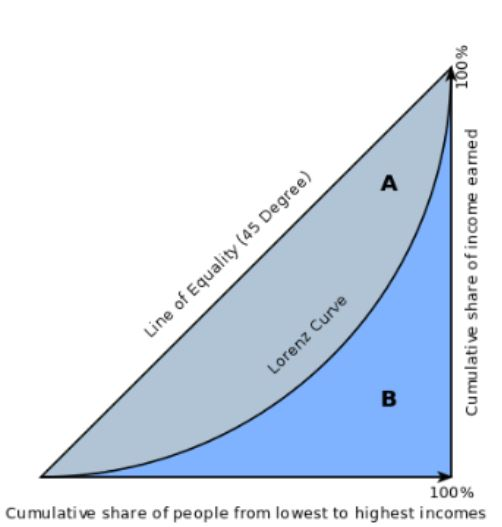
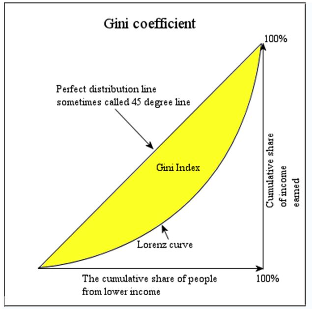

```{r setup, include=FALSE}
knitr::opts_chunk$set(echo = TRUE)
```

# 1. Introduction
## 1.1. Measures of Inequality

There exist various types of metrics used by economists to measure the income inequality. The most widely exploited ones are the Lorenz curves and the Gini coefficient, each of which have their own advantages and limitations. Those obvious limitations include the requirement for the population mean and variance to exist, as well as down-weighting smaller incomes and that way stressing way more attention to the middle incomes. This paper analyzes another income inequality measure, namely using ratios of symmetric quantiles, that proves to be helpful to overcome previously mentioned disadvantages. In addition to that, it is proven that the given metric satisfies the median preserving principle and applicable to widely used income distributions. But the major benefit is that there is no need of parametric model assumption to work with the given inequality measure.
  
  
## 1.2. Concepts and Definitions
### Lorenz curve and Gini coefficient 

A Lorenz curve is a graph used in economics to show inequality in income spread or wealth. The x-axis on a Lorenz curve typically shows the portion or percentage of the total population, and the y-axis shows the portion of total income/ wealth, or whatever is being analyzed.

Since perfect equality would mean that a $1/k$ portion of the population controlled $1/k$ of the wealth, perfect equality on the graph would be shown by a straight line with a slope of 1. This line is often drawn on the graph as a point of reference, alongside the curved line which represents the actual wealth/income/size distribution. The further away from the 1/1 baseline a particular curve is, the more pronounced the inequality.Any point on the curve can be read to tell us what percentage or portion of the population command what percent of the wealth, income, or whatever variable is being studied.

```{r, echo=F, out.width='40%'}

```

Gini ratio (or Gini coefficient) is a measure of inequality, based on the Lorenz curve, that goes from 0 (absolute equality) up to 1 (absolute inequality). It's calculated as a ratio of the areas on the Lorenz curve diagram. If the area between the line of perfect equality and Lorenz curve is $A$, and the area underneath the Lorenz curve is $B$, then the Gini coefficient is $A/(A+B)$.  

Greater inequality shows up as a larger area between the Lorenz curve and the diagonal line of absolute equality. 
  
```{r, echo=F, out.width='40%'}

```
  
#### Calculation

Since $A+B = 0.5$, the Gini coefficient, G = 2A = 1-2B. If the Lorenz curve is represented by the function Y = L(X), the value of B can be found with integration and:

$$
\begin{aligned}
G &= 1-2\int_{0}^{1} L(X)dX\\
\end{aligned}
$$
In some cases, this equation can be applied to calculate the Gini coefficient
without direct reference to the Lorenz curve. For example, for a population with values $y_i, i = 1...n$, that are indexed in non-decreasing order ( $y_i ≤ y_{i+1}$), with $S_i = \sum_{j=1}^{i}f(y_j)y_j, S_0=0$: 

$$
\begin{aligned}
G &= 1-\frac{\sum_{i=1}^{n}f(y_i)(S_{i-1}+S_i)}{S_n}\\
\end{aligned}
$$
For a cumulative distribution function $F(y)$ that is piecewise differentiable, has
a mean $\mu$, and is zero for all negative values of $y$:

$$
\begin{aligned}
G &= 1-\frac{1}{\mu}\int_{0}^{\infty}(1-F(y))^2dy  \\
\end{aligned}
$$
Sometimes the entire Lorenz curve is not known, and only values at certain intervals are given. In that case, the Gini coefficient can be approximated by using various techniques for interpolating the missing values of the Lorenz curve. If $(X_k,Y_k)$ are the known points on the Lorenz curve, with the $X_k$ indexed in increasing order $(X_{k-1} < X_k)$, so that: $X_k$ is the cumulated proportion of the population variable, for $k = 0,...,n$ with $X_0 = 0$, $X_n = 1$ and $Y_k$ is the cumulated proportion of the income variable, for $k = 0,...,n$, with $Y_0= 0$, $Y_n = 1$.

If the Lorenz curve is approximated on each interval as a line between consecutive
points, then the area $B$ can be approximated with trapezoids (Brown Formula) and:

$$
\begin{aligned}
G_1 &= |1-\sum_{k=1}^{n}(X_k- X_{k-1})(Y_k+ Y_{k-1})| \\
\end{aligned}
$$
is the resulting approximation for $G$.

More accurate results can be obtained using other methods to approximate the area B, such as approximating the Lorenz curve with a quadratic function across pairs of intervals, or building an appropriatelysmooth approximation to the underlying distribution function that matches the known data. If the population mean and boundary values for each interval are also known, these can also often be used to improve the accuracy of the approximation. 

#### Advantages: The Gini coefficient's main advantage is that it is a measure of inequality, not a measure of average income or some other variable which is unrepresentative of most of the population, such as gross domestic product.It can be used to compare income distributions across different population sectors as well as countries, for example the Gini coefficient for urban areas differs from that of rural areas in many countries.

#### Disadvantages: The Lorenz curve may understate the actual amount of inequality if richer households are able to use income more efficiently than lower income households. Lorenz curves may intersect, reflecting differing patterns of income distribution, but nevertheless resulting in very similar Gini coefficient values.This troubling property of the Lorenz framework complicates comparisons of Gini coefficient values and may confound tests of the income inequality hypothesis.It is also claimed that the Gini coefficient is more sensitive to the income of the middle classes than to that of the extremes. 


## 4.1. Disposable Personal Income

The data of Disposable Personal Income can be obtained at https://fred.stlouisfed.org/series/DSPI. 
```{r}
DSPI <- read.csv("C:\\Users\\Asus\\Downloads\\DSPI.csv")
plot(DSPI, type = "l", main = "Disposable Personal Income")
```

```{r}
QOR.ln <- function(u){
  # QOR function for the log-normal
  q.n.0 <- 1/dnorm(qnorm(u))
  q.n.1 <- qnorm(u)*q.n.0^2
  q.n.2 <- (1 + 2*qnorm(u)^2)*q.n.0^3
  1/(q.n.0^2 + 3*q.n.1 + q.n.2/q.n.0)
}

QOR.gld <- function(u, lambda = NULL){
  # QOR function for the GLD FKML paramaterization
  if(is.null(lambda)) lambda <- fit.fkml(x)$lambda
  l3 <- lambda[3]
  l4 <- lambda[4]
  (u^(l3 - 1) + (1 - u)^(l4 - 1))/(u^(l3 - 3)*(l3 - 2)*(l3 - 1) + 
                                     (1 - u)^(l4 - 3)*(l4 - 2)*(l4 - 1))
}

hatI <- function(x, J = 100, conf.level = 0.95,
                 bw.correct = TRUE, QOR.FUN = QOR.ln, ...){
  
  n <- length(x)
  
  us <- ((1:J) - 0.5)/J
  Rs <- (xu2 <- quantile(x, us/2))/(x1u2 <- quantile(x, 1 - us/2))
  I <- sum(1 - Rs)/J
  
  if(!is.null(conf.level)){
    v <- c(us/2, 1 - us/2)
    qor <- QOR.FUN(v, ...)
    bw <- 15^(1/5)*abs(qor)^(2/5)/n^(1/5)
    if (bw.correct) bw[v <= bw] <- v[v <= bw]
    
    kernepach <- function(u) 3/4*(1 - u^2)*(abs(u) <= 1)
    m1 <- matrix(v, nrow = 2*J, ncol = n, byrow = FALSE)
    m2 <- matrix(1:n, nrow = 2*J, ncol = n, byrow = TRUE)
    
    consts <- kernepach((m1 - (m2 - 1)/n)*(1/bw))*(1/bw) - 
      kernepach((m1 - m2/n)*(1/bw))*(1/bw)
    
    x.sorted <- sort(x)
    q.hat <- c(consts%*%x.sorted)
    q.hat.1 <- q.hat[1:(length(q.hat)/2)]
    q.hat.2 <- q.hat[-(1:(length(q.hat)/2))]
    
    rc <- matrix(Rs, ncol = J, nrow = J, byrow = FALSE)
    
    covm <- ((1/x1u2)%*%t(1/x1u2))*(((us/2)%*%t(1 - us/2))*(q.hat.1%*%t(q.hat.1) 
                                          + Rs%*%t(Rs)*(q.hat.2%*%t(q.hat.2))) -
                                ((us/2)%*%t(us/2))*((q.hat.1%*%t(q.hat.2))*t(rc) 
                                                 + (q.hat.2%*%t(q.hat.1))*rc))/n
    
    sigma.p2 <- (us/2)*(1 - us/2)*q.hat.1^2
    sigma.q2 <- (1 - us/2)*(us/2)*q.hat.2^2
    sigma.pq <- (us/2)^2*q.hat.1*q.hat.2
    a0 <- sigma.p2/x1u2^2
    a1 <- -2*sigma.pq/x1u2^2
    a2 <- sigma.q2/x1u2^2
    Vs <- (a0 + a1*Rs + a2*Rs^2)/n
    
    V <- (sum(Vs) + 2*sum(covm[row(covm) < col(covm)]))/J^2
    SE <- sqrt(V)
    conf.int <- I + c(-1, 1)*qnorm(1 - (1 - conf.level)/2)*sqrt(V)
  } else{
    V <- NULL
    SE <- NULL
    conf.int <- NULL
  } 
  
  list(I = I, SE = SE, conf.int = conf.int)
}

hatG <- function(x, conf.level = 0.95){
  indices <- 1:(n <- length(x))
  ordered.x <- sort(x)
  sx <- sum(ordered.x*(indices - 1/2))
  mu.hat <- mean(x)
  Gv <- 2/mu.hat/n^2*sx - 1
  
  Z.hat <- -(Gv + 1)*ordered.x + (2*indices - 1)/n*ordered.x - 
                                         2/n*cumsum(ordered.x)
  Z.bar <- mean(Z.hat)
  
  V <- 1/n^2/mu.hat^2*sum((Z.hat - Z.bar)^2)
  conf.int <- Gv + c(-1, 1)*qnorm(1 - (1 - conf.level)/2)*sqrt(V)
  
  list(G = Gv, SE = sqrt(V), conf.int = conf.int)
}
```

```{r}
DSPI <- DSPI$DSPI
I <- hatI(DSPI)
I

G <- hatG(DSPI)
G

```

```{r}
R_p <- function(x, J = 100){
  us <- ((1:J) - 0.5)/J
  Rs <- (quantile(x, us/2))/(quantile(x, 1 - us/2))
  return(cbind(us, Rs))
}

ineq_DSPI <- R_p(DSPI)
plot(ineq_DSPI, type = "l", main = "DSPI Inequality curve",
     xlab = "p", ylab = "R(p)")

```

Firstly, $I$ and $G$ were calculated for the Disposable Personal Income Data. It appears that $\hat I=0.7561$, which is an estimate of $I$, with a standard error of $0.0106$. Additionally, 95% confidence interval of $\hat I$ was calculated to be $(0.7352, 0.7769)$. While $\hat G = 0.4872$ is significantly lower, with a standard error of $0.0095$ and respective 95% confidence interval of $(0.4686, 0.5059)$.

## 4.2. Gross Domestic Income 

The data on Gross Domestic Income can be found here: https://fred.stlouisfed.org/series/GDI. 

```{r}
GDI <- read.csv("C:\\Users\\Asus\\Downloads\\GDI.csv")
plot(GDI, type = "l", main = "Gross Domestic Income")
```
```{r}
GDI <- GDI$GDI
I_gdi <- hatI(GDI)
I_gdi

G_gdi <- hatG(GDI)
G_gdi
```

```{r}
ineq_GDI <- R_p(GDI)
plot(ineq_GDI, type = "l", main = "GDI Inequality curve",
     xlab = "p", ylab = "R(p)")
```

As a result, ratio of symmetric quantiles of the GDI is $\hat I=0.8204$ with a standard error $0.0162$ and confidence interval $(0.7886,0.8523)$. At the same time $\hat G=0.5499$ with a standard error of $0.0161$ and CI $(0.5182,0.5815)$. 

## 4.3. Earnings data of women

The data on Earnings of women in the US between 1979 and 2020 can be otbained from: https://fred.stlouisfed.org/series/LES1252882700Q. 
```{r}
LES <- read.csv("C:\\Users\\Asus\\Downloads\\LES.csv")
plot(LES, type = "l", main = "Median usual weekly nominal earnings for women")
```
```{r}
LES <- LES$LES
I_les <- hatI(LES)
I_les

G_les <- hatG(LES)
G_les
```

```{r}
ineq_LES <- R_p(LES)
plot(ineq_LES, type = "l", main = "Earnings of women Inequality curve",
     xlab = "p", ylab = "R(p)")
```

Results reveal that $\hat I=0.4666$ with a standard error $0.0183$ and CI $(0.4307,0.5025)$. While Gini coefficient is $\hat G=0.2199 \pm0.0094$ with CI $(0.2015,0.2384)$. 

# 5. Prospective plans

To complete the project we need to elaborate on providing interpretation of obtained results. Additionally, we need to implement an algorithm to plot inequality curves using the well-known income distributions and compare values of $I$ and $G$ for them. Lastly, we need to include all the theoretical background of the concepts that were discussed in this project. 